###Analyzing the NYC Subway Dataset

    import pandas as pd
    import pandasql
    import datetime
    import time
    filename = "turnstile_weather_v2.csv"
    turnstile_weather = pd.read_csv(filename)
    print turnstile_weather.head()
    print turnstile_weather.shape

       UNIT     DATEn     TIMEn  ENTRIESn   EXITSn  ENTRIESn_hourly  \
    0  R003  05-01-11  00:00:00   4388333  2911002                0   
    1  R003  05-01-11  04:00:00   4388333  2911002                0   
    2  R003  05-01-11  12:00:00   4388333  2911002                0   
    3  R003  05-01-11  16:00:00   4388333  2911002                0   
    4  R003  05-01-11  20:00:00   4388333  2911002                0   
    
       EXITSn_hourly             datetime  hour  day_week    ...     pressurei  \
    0              0  2011-05-01 00:00:00     0         6    ...         30.22   
    1              0  2011-05-01 04:00:00     4         6    ...         30.25   
    2              0  2011-05-01 12:00:00    12         6    ...         30.28   
    3              0  2011-05-01 16:00:00    16         6    ...         30.26   
    4              0  2011-05-01 20:00:00    20         6    ...         30.28   
    
      rain  tempi  wspdi meanprecipi  meanpressurei  meantempi  meanwspdi  \
    0    0   55.9    3.5           0         30.258      55.98       7.86   
    1    0   52.0    3.5           0         30.258      55.98       7.86   
    2    0   62.1    6.9           0         30.258      55.98       7.86   
    3    0   57.9   15.0           0         30.258      55.98       7.86   
    4    0   52.0   10.4           0         30.258      55.98       7.86   
    
       weather_lat  weather_lon  
    0    40.700348   -73.887177  
    1    40.700348   -73.887177  
    2    40.700348   -73.887177  
    3    40.700348   -73.887177  
    4    40.700348   -73.887177  
    
    [5 rows x 27 columns]
    (42649, 27)

####Data Wrangling Code

    def filter_by_regular(filename):
        turnstile_data = pd.read_csv(filename)
        turnstile_data = turnstile_data[turnstile_data['DESCn']=='REGULAR']
        return turnstile_data
    def get_hourly_entries(df):
        '''
           1) Create a new column called ENTRIESn_hourly
           2) Assign to the column the difference between ENTRIESn of the current row 
              and the previous row. If there is any NaN, fill/replace it with 1.
        
               C/A  UNIT       SCP     DATEn     TIMEn    DESCn  ENTRIESn    EXITSn  ENTRIESn_hourly
        0     A002  R051  02-00-00  05-01-11  00:00:00  REGULAR   3144312   1088151                1
        1     A002  R051  02-00-00  05-01-11  04:00:00  REGULAR   3144335   1088159               23
        2     A002  R051  02-00-00  05-01-11  08:00:00  REGULAR   3144353   1088177               18
        3     A002  R051  02-00-00  05-01-11  12:00:00  REGULAR   3144424   1088231               71
        4     A002  R051  02-00-00  05-01-11  16:00:00  REGULAR   3144594   1088275              170
        5     A002  R051  02-00-00  05-01-11  20:00:00  REGULAR   3144808   1088317              214
        6     A002  R051  02-00-00  05-02-11  00:00:00  REGULAR   3144895   1088328               87
        7     A002  R051  02-00-00  05-02-11  04:00:00  REGULAR   3144905   1088331               10
        8     A002  R051  02-00-00  05-02-11  08:00:00  REGULAR   3144941   1088420               36
        9     A002  R051  02-00-00  05-02-11  12:00:00  REGULAR   3145094   1088753              153
        10    A002  R051  02-00-00  05-02-11  16:00:00  REGULAR   3145337   1088823              243
        ...
        ...
    
        '''
        currentrow = df["ENTRIESn"].notnull()
        df1 = df.shift(1)
        lastrow = df1["ENTRIESn"].notnull()
        df["ENTRIESn_hourly"] = df.loc[currentrow,"ENTRIESn"]-df1.loc[lastrow,"ENTRIESn"]
        
        nullrow = df["ENTRIESn_hourly"].isnull()
        df.loc[nullrow,"ENTRIESn_hourly"] = 1
        return df
    def get_hourly_exits(df):
        '''
           1) Create a new column called EXITSn_hourly
           2) Assign to the column the difference between EXITSn of the current row 
              and the previous row. If there is any NaN, fill/replace it with 0.
    
        
        Example dataframe below:
    
              Unnamed: 0   C/A  UNIT       SCP     DATEn     TIMEn    DESCn  ENTRIESn    EXITSn  ENTRIESn_hourly  EXITSn_hourly
        0              0  A002  R051  02-00-00  05-01-11  00:00:00  REGULAR   3144312   1088151                0              0
        1              1  A002  R051  02-00-00  05-01-11  04:00:00  REGULAR   3144335   1088159               23              8
        2              2  A002  R051  02-00-00  05-01-11  08:00:00  REGULAR   3144353   1088177               18             18
        3              3  A002  R051  02-00-00  05-01-11  12:00:00  REGULAR   3144424   1088231               71             54
        4              4  A002  R051  02-00-00  05-01-11  16:00:00  REGULAR   3144594   1088275              170             44
        5              5  A002  R051  02-00-00  05-01-11  20:00:00  REGULAR   3144808   1088317              214             42
        6              6  A002  R051  02-00-00  05-02-11  00:00:00  REGULAR   3144895   1088328               87             11
        7              7  A002  R051  02-00-00  05-02-11  04:00:00  REGULAR   3144905   1088331               10              3
        8              8  A002  R051  02-00-00  05-02-11  08:00:00  REGULAR   3144941   1088420               36             89
        9              9  A002  R051  02-00-00  05-02-11  12:00:00  REGULAR   3145094   1088753              153            333
        '''
        
        currentrow = df["EXITSn"].notnull()
        df1 = df.shift(1)
        lastrow = df1["EXITSn"].notnull()
        df["EXITSn_hourly"] = df.loc[currentrow,"EXITSn"]-df1.loc[lastrow,"EXITSn"]
        
        nullrow = df["EXITSn_hourly"].isnull()
        df.loc[nullrow,"EXITSn_hourly"] = 0
        return df
    def time_to_hour(time):
        '''
        Given an input variable time that represents time in the format of:
        "00:00:00" (hour:minutes:seconds)
        -if hour is 00, code should return 0
        '''
        hour = tp.strftime("%H", tp.strptime(time,"%H:%M:%S"))
        if hour[0] == "0":
            hour = hour.replace("0", "",1)
        hour = int(hour)
        return hour
    def reformat_subway_dates(date):
        date_formatted = time.strftime("%Y-%m-%d", time.strptime(date,"%m-%d-%y"))
        return date_formatted

####EDA & Data Visualization

    import numpy as np
    import pandas
    import matplotlib.pyplot as plt
    import matplotlib.patches as mpatches
    import scipy
    import scipy.stats
    import statsmodels.api as sm
    %matplotlib inline

    turnstile_weather.describe()

<table border="1" class="dataframe">
  <thead>
    <tr style="text-align: right;">
      <th></th>
      <th>ENTRIESn</th>
      <th>EXITSn</th>
      <th>ENTRIESn_hourly</th>
      <th>EXITSn_hourly</th>
      <th>hour</th>
      <th>day_week</th>
      <th>weekday</th>
      <th>latitude</th>
      <th>longitude</th>
      <th>fog</th>
      <th>...</th>
      <th>pressurei</th>
      <th>rain</th>
      <th>tempi</th>
      <th>wspdi</th>
      <th>meanprecipi</th>
      <th>meanpressurei</th>
      <th>meantempi</th>
      <th>meanwspdi</th>
      <th>weather_lat</th>
      <th>weather_lon</th>
    </tr>
  </thead>
  <tbody>
    <tr>
      <th>count</th>
      <td> 4.264900e+04</td>
      <td> 4.264900e+04</td>
      <td> 42649.000000</td>
      <td> 42649.000000</td>
      <td> 42649.000000</td>
      <td> 42649.000000</td>
      <td> 42649.000000</td>
      <td> 42649.000000</td>
      <td> 42649.000000</td>
      <td> 42649.000000</td>
      <td>...</td>
      <td> 42649.000000</td>
      <td> 42649.000000</td>
      <td> 42649.000000</td>
      <td> 42649.000000</td>
      <td> 42649.000000</td>
      <td> 42649.000000</td>
      <td> 42649.000000</td>
      <td> 42649.000000</td>
      <td> 42649.000000</td>
      <td> 42649.000000</td>
    </tr>
    <tr>
      <th>mean</th>
      <td> 2.812486e+07</td>
      <td> 1.986993e+07</td>
      <td>  1886.589955</td>
      <td>  1361.487866</td>
      <td>    10.046754</td>
      <td>     2.905719</td>
      <td>     0.714436</td>
      <td>    40.724647</td>
      <td>   -73.940364</td>
      <td>     0.009824</td>
      <td>...</td>
      <td>    29.971096</td>
      <td>     0.224741</td>
      <td>    63.103780</td>
      <td>     6.927872</td>
      <td>     0.004618</td>
      <td>    29.971096</td>
      <td>    63.103780</td>
      <td>     6.927872</td>
      <td>    40.728555</td>
      <td>   -73.938693</td>
    </tr>
    <tr>
      <th>std</th>
      <td> 3.043607e+07</td>
      <td> 2.028986e+07</td>
      <td>  2952.385585</td>
      <td>  2183.845409</td>
      <td>     6.938928</td>
      <td>     2.079231</td>
      <td>     0.451688</td>
      <td>     0.071650</td>
      <td>     0.059713</td>
      <td>     0.098631</td>
      <td>...</td>
      <td>     0.137942</td>
      <td>     0.417417</td>
      <td>     8.455597</td>
      <td>     4.510178</td>
      <td>     0.016344</td>
      <td>     0.131158</td>
      <td>     6.939011</td>
      <td>     3.179832</td>
      <td>     0.065420</td>
      <td>     0.059582</td>
    </tr>
    <tr>
      <th>min</th>
      <td> 0.000000e+00</td>
      <td> 0.000000e+00</td>
      <td>     0.000000</td>
      <td>     0.000000</td>
      <td>     0.000000</td>
      <td>     0.000000</td>
      <td>     0.000000</td>
      <td>    40.576152</td>
      <td>   -74.073622</td>
      <td>     0.000000</td>
      <td>...</td>
      <td>    29.550000</td>
      <td>     0.000000</td>
      <td>    46.900000</td>
      <td>     0.000000</td>
      <td>     0.000000</td>
      <td>    29.590000</td>
      <td>    49.400000</td>
      <td>     0.000000</td>
      <td>    40.600204</td>
      <td>   -74.014870</td>
    </tr>
    <tr>
      <th>25%</th>
      <td> 1.039762e+07</td>
      <td> 7.613712e+06</td>
      <td>   274.000000</td>
      <td>   237.000000</td>
      <td>     4.000000</td>
      <td>     1.000000</td>
      <td>     0.000000</td>
      <td>    40.677107</td>
      <td>   -73.987342</td>
      <td>     0.000000</td>
      <td>...</td>
      <td>    29.890000</td>
      <td>     0.000000</td>
      <td>    57.000000</td>
      <td>     4.600000</td>
      <td>     0.000000</td>
      <td>    29.913333</td>
      <td>    58.283333</td>
      <td>     4.816667</td>
      <td>    40.688591</td>
      <td>   -73.985130</td>
    </tr>
    <tr>
      <th>50%</th>
      <td> 1.818389e+07</td>
      <td> 1.331609e+07</td>
      <td>   905.000000</td>
      <td>   664.000000</td>
      <td>    12.000000</td>
      <td>     3.000000</td>
      <td>     1.000000</td>
      <td>    40.717241</td>
      <td>   -73.953459</td>
      <td>     0.000000</td>
      <td>...</td>
      <td>    29.960000</td>
      <td>     0.000000</td>
      <td>    61.000000</td>
      <td>     6.900000</td>
      <td>     0.000000</td>
      <td>    29.958000</td>
      <td>    60.950000</td>
      <td>     6.166667</td>
      <td>    40.720570</td>
      <td>   -73.949150</td>
    </tr>
    <tr>
      <th>75%</th>
      <td> 3.263049e+07</td>
      <td> 2.393771e+07</td>
      <td>  2255.000000</td>
      <td>  1537.000000</td>
      <td>    16.000000</td>
      <td>     5.000000</td>
      <td>     1.000000</td>
      <td>    40.759123</td>
      <td>   -73.907733</td>
      <td>     0.000000</td>
      <td>...</td>
      <td>    30.060000</td>
      <td>     0.000000</td>
      <td>    69.100000</td>
      <td>     9.200000</td>
      <td>     0.000000</td>
      <td>    30.060000</td>
      <td>    67.466667</td>
      <td>     8.850000</td>
      <td>    40.755226</td>
      <td>   -73.912033</td>
    </tr>
    <tr>
      <th>max</th>
      <td> 2.357746e+08</td>
      <td> 1.493782e+08</td>
      <td> 32814.000000</td>
      <td> 34828.000000</td>
      <td>    20.000000</td>
      <td>     6.000000</td>
      <td>     1.000000</td>
      <td>    40.889185</td>
      <td>   -73.755383</td>
      <td>     1.000000</td>
      <td>...</td>
      <td>    30.320000</td>
      <td>     1.000000</td>
      <td>    86.000000</td>
      <td>    23.000000</td>
      <td>     0.157500</td>
      <td>    30.293333</td>
      <td>    79.800000</td>
      <td>    17.083333</td>
      <td>    40.862064</td>
      <td>   -73.694176</td>
    </tr>
  </tbody>
</table>

8 rows × 21 columns

    print "# of no fog days: ", turnstile_weather[turnstile_weather["fog"]==0].shape
    print "# of fog days: ", turnstile_weather[turnstile_weather["fog"]==1].shape

    # of no fog days:  (42230, 27)
    # of fog days:  (419, 27)

    #Number of Subway Entries on Rainy Days vs. No Rainy Days
    def entries_histogram(turnstile_weather):
        plt.figure()
        turnstile_weather['ENTRIESn_hourly'][turnstile_weather['rain']==0].hist(bins=50, color="blue", label="no rain") # your code here to plot a historgram for hourly entries when it is raining
        turnstile_weather['ENTRIESn_hourly'][turnstile_weather['rain']==1].hist(bins=50, color="green", label="rain") # your code here to plot a historgram for hourly entries when it is not raining
        plt.legend(prop={'size': 10})
        plt.suptitle('Histogram of ENTRIESn_hourly')
        plt.ylabel('Frequency')
        plt.xlabel('ENTRIESn_hourly')
        return plt
    entries_histogram(turnstile_weather)

    <module 'matplotlib.pyplot' from '//anaconda/lib/python2.7/site-packages/matplotlib/pyplot.pyc'>

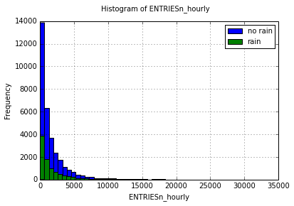

    for col in turnstile_weather.columns:
        print col, turnstile_weather[col].unique().shape

    UNIT (240,)
    DATEn (31,)
    TIMEn (6,)
    ENTRIESn (41949,)
    EXITSn (42045,)
    ENTRIESn_hourly (7667,)
    EXITSn_hourly (6212,)
    datetime (186,)
    hour (6,)
    day_week (7,)
    weekday (2,)
    station (207,)
    latitude (233,)
    longitude (234,)
    conds (12,)
    fog (2,)
    precipi (11,)
    pressurei (73,)
    rain (2,)
    tempi (52,)
    wspdi (19,)
    meanprecipi (31,)
    meanpressurei (270,)
    meantempi (343,)
    meanwspdi (241,)
    weather_lat (37,)
    weather_lon (37,)

    variable = "rain"
    variable_unique = turnstile_weather[variable].unique()
    ENTRIESn_hourly_mean = [turnstile_weather['ENTRIESn_hourly'][turnstile_weather[variable]==i].mean() for i in variable_unique]
    plt.bar(variable_unique,ENTRIESn_hourly_mean,1)
    plt.ylabel('Average ENTRIESn_hourly')
    plt.xlabel(variable)
    plt.show()

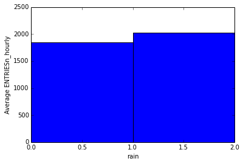

    variable = "fog"
    variable_unique = turnstile_weather[variable].unique()
    ENTRIESn_hourly_mean = [turnstile_weather['ENTRIESn_hourly'][turnstile_weather[variable]==i].mean() for i in variable_unique]
    plt.bar(variable_unique,ENTRIESn_hourly_mean,1)
    plt.ylabel('Average ENTRIESn_hourly')
    plt.xlabel(variable)
    plt.show()

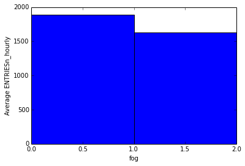

    variable = "day_week"
    variable_unique = turnstile_weather[variable].unique()
    ENTRIESn_hourly_mean = [turnstile_weather['ENTRIESn_hourly'][turnstile_weather[variable]==i].mean() for i in variable_unique]
    plt.bar(variable_unique,ENTRIESn_hourly_mean,1)
    plt.ylabel('Average ENTRIESn_hourly')
    plt.xlabel(variable)
    plt.show()

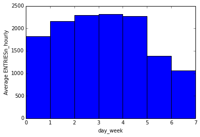

    variable = "hour"
    variable_unique = turnstile_weather[variable].unique()
    ENTRIESn_hourly_mean = [turnstile_weather['ENTRIESn_hourly'][turnstile_weather[variable]==i].mean() for i in variable_unique]
    plt.bar(variable_unique,ENTRIESn_hourly_mean)
    plt.ylabel('Average ENTRIESn_hourly')
    plt.xlabel(variable)
    plt.show()

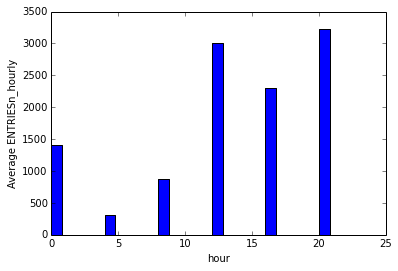

    turnstile_weather['ENTRIESn_hourly'].hist(bins=30)
    plt.show()

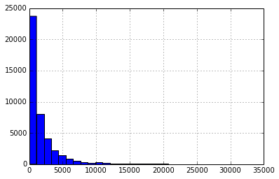

    turnstile_weather['day_week'].hist()
    plt.show()
    turnstile_weather['day_week'].unique()

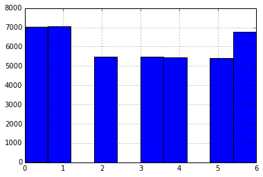

    array([6, 0, 1, 2, 3, 4, 5])

    turnstile_weather['tempi'].hist()
    plt.show()

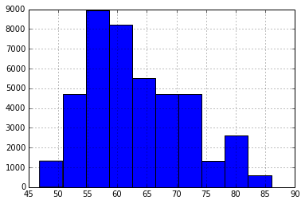

    plt.scatter(turnstile_weather['tempi'],turnstile_weather['ENTRIESn_hourly'])
    plt.show()

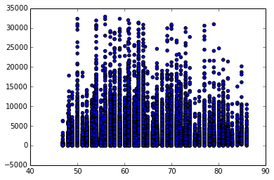

    no_rain = turnstile_weather['ENTRIESn_hourly'][turnstile_weather['rain']==0]
    rain = turnstile_weather['ENTRIESn_hourly'][turnstile_weather['rain']==1]
    print scipy.stats.mannwhitneyu(rain,no_rain)
    #print scipy.stats.ttest_ind(rain,no_rain)
    print "no rain: ",no_rain.describe()
    print "rain: ",rain.describe()

    (153635120.5, 2.7410695712437496e-06)
    no rain:  count    33064.000000
    mean      1845.539439
    std       2878.770848
    min          0.000000
    25%        269.000000
    50%        893.000000
    75%       2197.000000
    max      32814.000000
    dtype: float64
    rain:  count     9585.000000
    mean      2028.196035
    std       3189.433373
    min          0.000000
    25%        295.000000
    50%        939.000000
    75%       2424.000000
    max      32289.000000
    dtype: float64

    2.7410695712437496e-06*2

    5.482139142487499e-06

    import pandas as pd
    from ggplot import *
    import matplotlib.pyplot as plot
    
    def plot_weather_data(turnstile_weather):
        data = pd.melt(turnstile_weather[['Hour', 'ENTRIESn_hourly']], id_vars='Hour')
        plot = ggplot(aes(x='Hour', y='value', colour='variable'), data=data) + geom_point() + stat_smooth(color='red') + ylim(0, 45000) + xlim(0, 25)
        return plot 
    
    def plot_weather_data(turnstile_weather):
        data = pd.melt(turnstile_weather[['rain', 'ENTRIESn_hourly']], id_vars='rain')
        plot = ggplot(aes(x='rain', y='value', colour='variable'), data=data) + geom_point() + stat_smooth(color='red') + ylim(0, 45000) + xlim(0, 25)
        
        return plot

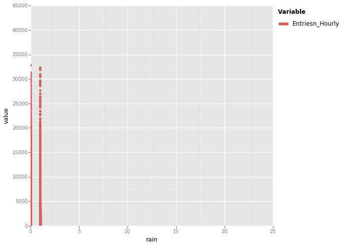

    <ggplot: (287536977)>

    turnstile_weather.corr()

<table border="1" class="dataframe">
  <thead>
    <tr style="text-align: right;">
      <th></th>
      <th>ENTRIESn</th>
      <th>EXITSn</th>
      <th>ENTRIESn_hourly</th>
      <th>EXITSn_hourly</th>
      <th>hour</th>
      <th>day_week</th>
      <th>weekday</th>
      <th>latitude</th>
      <th>longitude</th>
      <th>fog</th>
      <th>...</th>
      <th>pressurei</th>
      <th>rain</th>
      <th>tempi</th>
      <th>wspdi</th>
      <th>meanprecipi</th>
      <th>meanpressurei</th>
      <th>meantempi</th>
      <th>meanwspdi</th>
      <th>weather_lat</th>
      <th>weather_lon</th>
    </tr>
  </thead>
  <tbody>
    <tr>
      <th>ENTRIESn</th>
      <td> 1.000000</td>
      <td> 0.924739</td>
      <td> 0.585895</td>
      <td> 0.530925</td>
      <td>-0.005358</td>
      <td>-0.001476</td>
      <td>-0.002457</td>
      <td> 0.126110</td>
      <td>-0.207909</td>
      <td>-0.010882</td>
      <td>...</td>
      <td>-0.003690</td>
      <td>-0.002044</td>
      <td> 0.013471</td>
      <td>-0.091524</td>
      <td> 0.027374</td>
      <td> 0.007444</td>
      <td> 0.015420</td>
      <td>-0.122455</td>
      <td> 0.085958</td>
      <td>-0.224917</td>
    </tr>
    <tr>
      <th>EXITSn</th>
      <td> 0.924739</td>
      <td> 1.000000</td>
      <td> 0.552648</td>
      <td> 0.582130</td>
      <td>-0.005421</td>
      <td>-0.002259</td>
      <td>-0.002270</td>
      <td> 0.072566</td>
      <td>-0.237180</td>
      <td>-0.010703</td>
      <td>...</td>
      <td>-0.002794</td>
      <td>-0.003339</td>
      <td> 0.015093</td>
      <td>-0.107243</td>
      <td> 0.032721</td>
      <td> 0.008660</td>
      <td> 0.017962</td>
      <td>-0.144446</td>
      <td> 0.023488</td>
      <td>-0.255539</td>
    </tr>
    <tr>
      <th>ENTRIESn_hourly</th>
      <td> 0.585895</td>
      <td> 0.552648</td>
      <td> 1.000000</td>
      <td> 0.640267</td>
      <td> 0.286798</td>
      <td>-0.094897</td>
      <td> 0.145431</td>
      <td> 0.115635</td>
      <td>-0.124047</td>
      <td>-0.008590</td>
      <td>...</td>
      <td>-0.033361</td>
      <td> 0.025825</td>
      <td> 0.089596</td>
      <td> 0.056030</td>
      <td> 0.035649</td>
      <td>-0.006186</td>
      <td>-0.026693</td>
      <td>-0.039724</td>
      <td> 0.089156</td>
      <td>-0.137889</td>
    </tr>
    <tr>
      <th>EXITSn_hourly</th>
      <td> 0.530925</td>
      <td> 0.582130</td>
      <td> 0.640267</td>
      <td> 1.000000</td>
      <td> 0.252758</td>
      <td>-0.080410</td>
      <td> 0.125729</td>
      <td> 0.091075</td>
      <td>-0.134714</td>
      <td>-0.009003</td>
      <td>...</td>
      <td>-0.031422</td>
      <td> 0.024134</td>
      <td> 0.090438</td>
      <td> 0.038179</td>
      <td> 0.037047</td>
      <td>-0.005257</td>
      <td>-0.021891</td>
      <td>-0.055954</td>
      <td> 0.059765</td>
      <td>-0.152295</td>
    </tr>
    <tr>
      <th>hour</th>
      <td>-0.005358</td>
      <td>-0.005421</td>
      <td> 0.286798</td>
      <td> 0.252758</td>
      <td> 1.000000</td>
      <td> 0.006010</td>
      <td>-0.005271</td>
      <td>-0.000904</td>
      <td> 0.001106</td>
      <td> 0.038454</td>
      <td>...</td>
      <td>-0.067935</td>
      <td>-0.000697</td>
      <td> 0.274048</td>
      <td> 0.255057</td>
      <td>-0.001771</td>
      <td>-0.002360</td>
      <td> 0.001370</td>
      <td> 0.000496</td>
      <td>-0.000731</td>
      <td> 0.001431</td>
    </tr>
    <tr>
      <th>day_week</th>
      <td>-0.001476</td>
      <td>-0.002259</td>
      <td>-0.094897</td>
      <td>-0.080410</td>
      <td> 0.006010</td>
      <td> 1.000000</td>
      <td>-0.805805</td>
      <td>-0.000328</td>
      <td>-0.001881</td>
      <td> 0.016179</td>
      <td>...</td>
      <td>-0.061134</td>
      <td>-0.082490</td>
      <td>-0.029176</td>
      <td>-0.223378</td>
      <td>-0.127240</td>
      <td>-0.064296</td>
      <td>-0.035553</td>
      <td>-0.316833</td>
      <td>-0.001059</td>
      <td>-0.002209</td>
    </tr>
    <tr>
      <th>weekday</th>
      <td>-0.002457</td>
      <td>-0.002270</td>
      <td> 0.145431</td>
      <td> 0.125729</td>
      <td>-0.005271</td>
      <td>-0.805805</td>
      <td> 1.000000</td>
      <td>-0.000396</td>
      <td> 0.002103</td>
      <td>-0.008605</td>
      <td>...</td>
      <td> 0.042391</td>
      <td> 0.130846</td>
      <td>-0.011989</td>
      <td> 0.155019</td>
      <td> 0.112940</td>
      <td> 0.044583</td>
      <td>-0.014609</td>
      <td> 0.219874</td>
      <td> 0.000124</td>
      <td> 0.002869</td>
    </tr>
    <tr>
      <th>latitude</th>
      <td> 0.126110</td>
      <td> 0.072566</td>
      <td> 0.115635</td>
      <td> 0.091075</td>
      <td>-0.000904</td>
      <td>-0.000328</td>
      <td>-0.000396</td>
      <td> 1.000000</td>
      <td> 0.129291</td>
      <td>-0.016329</td>
      <td>...</td>
      <td>-0.012792</td>
      <td> 0.003906</td>
      <td>-0.008954</td>
      <td> 0.099332</td>
      <td>-0.043688</td>
      <td>-0.013454</td>
      <td>-0.010911</td>
      <td> 0.140890</td>
      <td> 0.973716</td>
      <td> 0.054721</td>
    </tr>
    <tr>
      <th>longitude</th>
      <td>-0.207909</td>
      <td>-0.237180</td>
      <td>-0.124047</td>
      <td>-0.134714</td>
      <td> 0.001106</td>
      <td>-0.001881</td>
      <td> 0.002103</td>
      <td> 0.129291</td>
      <td> 1.000000</td>
      <td> 0.017415</td>
      <td>...</td>
      <td>-0.002685</td>
      <td> 0.000133</td>
      <td>-0.049732</td>
      <td> 0.354106</td>
      <td>-0.098675</td>
      <td>-0.002824</td>
      <td>-0.060602</td>
      <td> 0.502253</td>
      <td> 0.167971</td>
      <td> 0.953024</td>
    </tr>
    <tr>
      <th>fog</th>
      <td>-0.010882</td>
      <td>-0.010703</td>
      <td>-0.008590</td>
      <td>-0.009003</td>
      <td> 0.038454</td>
      <td> 0.016179</td>
      <td>-0.008605</td>
      <td>-0.016329</td>
      <td> 0.017415</td>
      <td> 1.000000</td>
      <td>...</td>
      <td>-0.084171</td>
      <td> 0.144566</td>
      <td>-0.036755</td>
      <td>-0.015084</td>
      <td> 0.091856</td>
      <td>-0.091208</td>
      <td>-0.031044</td>
      <td> 0.050557</td>
      <td>-0.014650</td>
      <td> 0.018134</td>
    </tr>
    <tr>
      <th>precipi</th>
      <td> 0.011409</td>
      <td> 0.013877</td>
      <td>-0.027682</td>
      <td>-0.027940</td>
      <td>-0.081902</td>
      <td>-0.080508</td>
      <td> 0.071460</td>
      <td>-0.027642</td>
      <td>-0.062434</td>
      <td> 0.298599</td>
      <td>...</td>
      <td>-0.071145</td>
      <td> 0.331453</td>
      <td>-0.153103</td>
      <td> 0.225957</td>
      <td> 0.632725</td>
      <td>-0.079944</td>
      <td>-0.144916</td>
      <td> 0.203016</td>
      <td>-0.029663</td>
      <td>-0.060101</td>
    </tr>
    <tr>
      <th>pressurei</th>
      <td>-0.003690</td>
      <td>-0.002794</td>
      <td>-0.033361</td>
      <td>-0.031422</td>
      <td>-0.067935</td>
      <td>-0.061134</td>
      <td> 0.042391</td>
      <td>-0.012792</td>
      <td>-0.002685</td>
      <td>-0.084171</td>
      <td>...</td>
      <td> 1.000000</td>
      <td>-0.349881</td>
      <td>-0.062865</td>
      <td>-0.088730</td>
      <td>-0.120136</td>
      <td> 0.950826</td>
      <td>-0.002256</td>
      <td>-0.100448</td>
      <td>-0.012337</td>
      <td>-0.002015</td>
    </tr>
    <tr>
      <th>rain</th>
      <td>-0.002044</td>
      <td>-0.003339</td>
      <td> 0.025825</td>
      <td> 0.024134</td>
      <td>-0.000697</td>
      <td>-0.082490</td>
      <td> 0.130846</td>
      <td> 0.003906</td>
      <td> 0.000133</td>
      <td> 0.144566</td>
      <td>...</td>
      <td>-0.349881</td>
      <td> 1.000000</td>
      <td>-0.263788</td>
      <td> 0.151034</td>
      <td> 0.523850</td>
      <td>-0.367976</td>
      <td>-0.321441</td>
      <td> 0.214222</td>
      <td> 0.003483</td>
      <td> 0.000122</td>
    </tr>
    <tr>
      <th>tempi</th>
      <td> 0.013471</td>
      <td> 0.015093</td>
      <td> 0.089596</td>
      <td> 0.090438</td>
      <td> 0.274048</td>
      <td>-0.029176</td>
      <td>-0.011989</td>
      <td>-0.008954</td>
      <td>-0.049732</td>
      <td>-0.036755</td>
      <td>...</td>
      <td>-0.062865</td>
      <td>-0.263788</td>
      <td> 1.000000</td>
      <td>-0.007493</td>
      <td>-0.187955</td>
      <td>-0.001947</td>
      <td> 0.820641</td>
      <td>-0.166010</td>
      <td>-0.011448</td>
      <td>-0.047833</td>
    </tr>
    <tr>
      <th>wspdi</th>
      <td>-0.091524</td>
      <td>-0.107243</td>
      <td> 0.056030</td>
      <td> 0.038179</td>
      <td> 0.255057</td>
      <td>-0.223378</td>
      <td> 0.155019</td>
      <td> 0.099332</td>
      <td> 0.354106</td>
      <td>-0.015084</td>
      <td>...</td>
      <td>-0.088730</td>
      <td> 0.151034</td>
      <td>-0.007493</td>
      <td> 1.000000</td>
      <td> 0.226218</td>
      <td>-0.074482</td>
      <td>-0.142623</td>
      <td> 0.705035</td>
      <td> 0.113621</td>
      <td> 0.341988</td>
    </tr>
    <tr>
      <th>meanprecipi</th>
      <td> 0.027374</td>
      <td> 0.032721</td>
      <td> 0.035649</td>
      <td> 0.037047</td>
      <td>-0.001771</td>
      <td>-0.127240</td>
      <td> 0.112940</td>
      <td>-0.043688</td>
      <td>-0.098675</td>
      <td> 0.091856</td>
      <td>...</td>
      <td>-0.120136</td>
      <td> 0.523850</td>
      <td>-0.187955</td>
      <td> 0.226218</td>
      <td> 1.000000</td>
      <td>-0.126349</td>
      <td>-0.229034</td>
      <td> 0.320860</td>
      <td>-0.046881</td>
      <td>-0.094988</td>
    </tr>
    <tr>
      <th>meanpressurei</th>
      <td> 0.007444</td>
      <td> 0.008660</td>
      <td>-0.006186</td>
      <td>-0.005257</td>
      <td>-0.002360</td>
      <td>-0.064296</td>
      <td> 0.044583</td>
      <td>-0.013454</td>
      <td>-0.002824</td>
      <td>-0.091208</td>
      <td>...</td>
      <td> 0.950826</td>
      <td>-0.367976</td>
      <td>-0.001947</td>
      <td>-0.074482</td>
      <td>-0.126349</td>
      <td> 1.000000</td>
      <td>-0.002372</td>
      <td>-0.105643</td>
      <td>-0.012975</td>
      <td>-0.002120</td>
    </tr>
    <tr>
      <th>meantempi</th>
      <td> 0.015420</td>
      <td> 0.017962</td>
      <td>-0.026693</td>
      <td>-0.021891</td>
      <td> 0.001370</td>
      <td>-0.035553</td>
      <td>-0.014609</td>
      <td>-0.010911</td>
      <td>-0.060602</td>
      <td>-0.031044</td>
      <td>...</td>
      <td>-0.002256</td>
      <td>-0.321441</td>
      <td> 0.820641</td>
      <td>-0.142623</td>
      <td>-0.229034</td>
      <td>-0.002372</td>
      <td> 1.000000</td>
      <td>-0.202293</td>
      <td>-0.013950</td>
      <td>-0.058287</td>
    </tr>
    <tr>
      <th>meanwspdi</th>
      <td>-0.122455</td>
      <td>-0.144446</td>
      <td>-0.039724</td>
      <td>-0.055954</td>
      <td> 0.000496</td>
      <td>-0.316833</td>
      <td> 0.219874</td>
      <td> 0.140890</td>
      <td> 0.502253</td>
      <td> 0.050557</td>
      <td>...</td>
      <td>-0.100448</td>
      <td> 0.214222</td>
      <td>-0.166010</td>
      <td> 0.705035</td>
      <td> 0.320860</td>
      <td>-0.105643</td>
      <td>-0.202293</td>
      <td> 1.000000</td>
      <td> 0.161156</td>
      <td> 0.485065</td>
    </tr>
    <tr>
      <th>weather_lat</th>
      <td> 0.085958</td>
      <td> 0.023488</td>
      <td> 0.089156</td>
      <td> 0.059765</td>
      <td>-0.000731</td>
      <td>-0.001059</td>
      <td> 0.000124</td>
      <td> 0.973716</td>
      <td> 0.167971</td>
      <td>-0.014650</td>
      <td>...</td>
      <td>-0.012337</td>
      <td> 0.003483</td>
      <td>-0.011448</td>
      <td> 0.113621</td>
      <td>-0.046881</td>
      <td>-0.012975</td>
      <td>-0.013950</td>
      <td> 0.161156</td>
      <td> 1.000000</td>
      <td> 0.095682</td>
    </tr>
    <tr>
      <th>weather_lon</th>
      <td>-0.224917</td>
      <td>-0.255539</td>
      <td>-0.137889</td>
      <td>-0.152295</td>
      <td> 0.001431</td>
      <td>-0.002209</td>
      <td> 0.002869</td>
      <td> 0.054721</td>
      <td> 0.953024</td>
      <td> 0.018134</td>
      <td>...</td>
      <td>-0.002015</td>
      <td> 0.000122</td>
      <td>-0.047833</td>
      <td> 0.341988</td>
      <td>-0.094988</td>
      <td>-0.002120</td>
      <td>-0.058287</td>
      <td> 0.485065</td>
      <td> 0.095682</td>
      <td> 1.000000</td>
    </tr>
  </tbody>
</table>

21 rows × 21 columns

    #1 - Number of Rainy Days
    def num_rainy_days(filename):
        weather_data = pandas.read_csv(filename)
        q = """
        SELECT count(rain)
        FROM weather_data
        WHERE rain = 1
        GROUP BY rain
        """
        rainy_days = pandasql.sqldf(q.lower(), locals())
        return rainy_days
    #2 - Temp on Foggy and Nonfoggy Days
    def max_temp_aggregate_by_fog(filename):
        weather_data = pandas.read_csv(filename)
        q = """
        SELECT fog, max(maxtempi)
        FROM weather_data
        GROUP BY fog
        """
        foggy_days = pandasql.sqldf(q.lower(), locals())
        return foggy_days
    #3 - Mean Temp on Weekends
    def avg_weekend_temperature(filename):
        weather_data = pandas.read_csv(filename)
        q = """
        SELECT avg(meantempi)
        FROM weather_data
        WHERE cast (strftime('%w', date) as integer) = 0 OR cast (strftime('%w', date) as integer) = 6
        GROUP BY cast (strftime('%w', date) as integer) = 0 AND cast (strftime('%w', date) as integer) = 6
        """
        mean_temp_weekends = pandasql.sqldf(q.lower(), locals())
        print mean_temp_weekends
        return mean_temp_weekends
    #Mean Temp on Rainy Days
    def avg_min_temperature(filename):
        weather_data = pandas.read_csv(filename)
        q = """
        SELECT avg(mintempi)
        FROM weather_data
        WHERE mintempi > 55 AND rain = 1
        """
        avg_min_temp_rainy = pandasql.sqldf(q.lower(), locals())
        return avg_min_temp_rainy

####Data Analysis

#####1. Linear Regression (Units as Dummy)

    #Linear Regression
    def linear_regression(features, values):
        """
        Perform linear regression given a data set with an arbitrary number of features.
        """
        features = sm.add_constant(features)
        model = sm.OLS(values, features)
        results = model.fit()
        intercept = results.params[0]
        params = results.params[1:]
        return intercept, params
    
    features = turnstile_weather[['rain', 'precipi', 'hour', 'meantempi','meanwspdi']]
    dummy_units = pandas.get_dummies(turnstile_weather['UNIT'], prefix='unit')
    features = features.join(dummy_units)
    values = turnstile_weather['ENTRIESn_hourly']
    intercept, params = linear_regression(features, values)
    predictions = intercept + np.dot(features, params)
    
    #Histogram of Residuals
    plt.figure()
    (values - predictions).hist()
    plt.xlabel("Residuals")
    plt.ylabel("Frequency")
    plt.title("Histogram of Residuals from Linear Regression")
    plt.show()
    
    #Calculate R squared
    SST = ((values-np.mean(values))**2).sum()
    SSReg = ((predictions-values)**2).sum()
    r_squared = 1-SSReg/SST
    print "R^2: ",r_squared

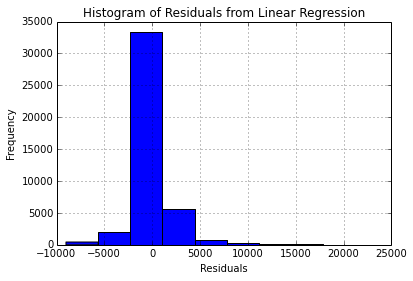

    R^2:  0.46219482461

