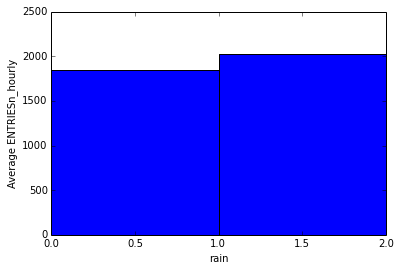
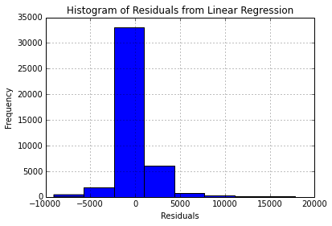
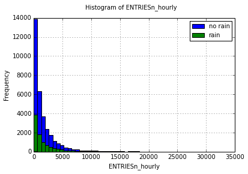
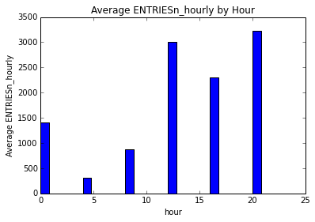

###Section 1. Statistical Test

#####1.1 Which statistical test did you use to analyze the NYC subway data? Did you use a one-tail or a two-tail P value? What is the null hypothesis? What is your p-critical value?
: I performed a Mann–Whitney U test to test the null hypothesis that the two samples come from the same population (ENTRIESn_hourly on rainy days and ENTRIESn_hourly on non-rainy days).

The alternative hypothesis is that population to which ENTRIESn_hourly sample on rainy days belongs has higher mean than does population to which ENTRIESn_hourly sample on non-rainy days belongs. This was a two-tailed test and the critical value at 95% CI is 0.05.

#####1.2 Why is this statistical test applicable to the dataset? In particular, consider the assumptions that the test is making about the distribution of ridership in the two samples.
: The test is applicable to understanding the relationship between rain and ENTRIESn_hourly. The bar graph below shows that rain=1 has higher mean of ENTRIESn_hourly variable than rain=0. The two samples are not normally distributed, which Mann–Whitney U test does not require.   

The assumptions of the Mann–Whitney U test are that two samples are independent of each other and observations are ranks. Both of the assumptions are met in this dataset, as at the very least, two samples are independent and the observations are numeric.

#####1.3 What results did you get from this statistical test? These should include the following numerical values: p-values, as well as the means for each of the two samples under test.
:the U-test statistic is 153,635,120.5 and p-value is 5.482139142487499e-06. 

U-test statistic: 153,635,120.5 
P-value for two-tailed test: 5.482139142487499e-06

no rain:  count    33064
mean      1845.539439
std       2878.770848

rain:  count     9585
mean      2028.196035
std       3189.433373

#####1.4 What is the significance and interpretation of these results?
: At this p-value less than 0.05, I can reject the null that the two samples are from the same population. 

    import pandas as pd
    import matplotlib.pyplot as plt
    %matplotlib inline
    filename = "turnstile_weather_v2.csv"
    turnstile_weather = pd.read_csv(filename)
    
    variable = "rain"
    variable_unique = turnstile_weather[variable].unique()
    ENTRIESn_hourly_mean = [turnstile_weather['ENTRIESn_hourly'][turnstile_weather[variable]==i].mean() for i in variable_unique]
    plt.bar(variable_unique,ENTRIESn_hourly_mean,1)
    plt.ylabel('Average ENTRIESn_hourly')
    plt.xlabel(variable)
    plt.show()

###Section 2. Linear Regression

#####2.1 What approach did you use to compute the coefficients theta and produce prediction for ENTRIESn_hourly in your regression model:
I used a linear regression wtih statsmodels-sm.OLS. 

#####2.2 What features (input variables) did you use in your model? Did you use any dummy variables as part of your features?
Features: 'rain', 'precipi', 'hour', 'meantempi','meanwspdi'
Dummy Variables: 'Units'

#####2.3 Why did you select these features in your model? 
: Things I considered include correlation with the dependent variable as well as correlation with other indendpedent variable. While I wanted to choose ones with highest correlation with the dependent variable, I also wanted to avoid multicollinearity by not including both variables that correlate with each other. Through different iterations of choosing variables, I ended up with these.

#####2.4 What are the parameters (also known as "coefficients" or "weights") of the non-dummy features in your linear regression model?
rain          128.776759
precipi     -4018.110262
hour          121.836848
meantempi     -10.425143
meanwspdi      45.161259

#####2.5 What is your model’s R2 (coefficients of determination) value?
R^2:  0.462026173779

#####2.6 What does this R2 value mean for the goodness of fit for your regression model? Do you think this linear model to predict ridership is appropriate for this dataset, given this R2  value?
R2 value means that 46% of the variance of errors is explained by the model. The residual plot below shows long tails on both ends, which indicates that this linear regression may not be sufficient. To improve the predictions, I may need to try a nonlinear model.

    import pandas
    import statsmodels.api as sm
    import numpy as np
    
    def linear_regression(features, values):
        """
        Perform linear regression given a data set with an arbitrary number of features.
        """
        features = sm.add_constant(features)
        model = sm.OLS(values, features)
        results = model.fit()
        intercept = results.params[0]
        params = results.params[1:]
        return intercept, params
    
    features = turnstile_weather[['rain', 'precipi', 'hour', 'meantempi','meanwspdi']]
    dummy_units = pandas.get_dummies(turnstile_weather['UNIT'], prefix='unit')
    features = features.join(dummy_units)
    values = turnstile_weather['ENTRIESn_hourly']
    intercept, params = linear_regression(features, values)
    predictions = intercept + np.dot(features, params)
    
    plt.figure()
    (values - predictions).hist()
    plt.xlabel("Residuals")
    plt.ylabel("Frequency")
    plt.title("Histogram of Residuals from Linear Regression")
    plt.xlim([-10000,20000])
    plt.show()

###Section 3. Visualization

#####3.1 One visualization should contain two histograms: one of  ENTRIESn_hourly for rainy days and one of ENTRIESn_hourly for non-rainy days.
: The histogram below shows frequency of ENTRIESn_hourly for rainy days and non-rainy days. It seems that on non-rainy days, there are more hours with zero entry than on rainy days. However, this also shows that there are a lot more non-rainy days than rainy days, which explains that frequency on no rain is always higher than frequency on rain.

    import pandas as pd
    import datetime
    import time
    import matplotlib.pyplot as plt
    %matplotlib inline
    filename = "turnstile_weather_v2.csv"
    turnstile_weather = pd.read_csv(filename)
    #Number of Subway Entries on Rainy Days vs. No Rainy Days
    def entries_histogram(turnstile_weather):
        plt.figure()
        turnstile_weather['ENTRIESn_hourly'][turnstile_weather['rain']==0].hist(bins=50, color="blue", label="no rain") # your code here to plot a historgram for hourly entries when it is raining
        turnstile_weather['ENTRIESn_hourly'][turnstile_weather['rain']==1].hist(bins=50, color="green", label="rain") # your code here to plot a historgram for hourly entries when it is not raining
        plt.legend(prop={'size': 10})
        plt.suptitle('Histogram of ENTRIESn_hourly')
        plt.ylabel('Frequency')
        plt.xlabel('ENTRIESn_hourly')
        return plt
    entries_histogram(turnstile_weather)

    <module 'matplotlib.pyplot' from '//anaconda/lib/python2.7/site-packages/matplotlib/pyplot.pyc'>

#####3.2 One visualization can be more freeform. You should feel free to implement something that we discussed in class (e.g., scatter plots, line plots) or attempt to implement something more advanced if you'd like. Some suggestions are:
:The following is a bar plot of average ENTRIESn_hourly for every unique value of 'hour'. This shows that 8pm (x=20) has the highest average entries compared to other hours. 

    variable = "hour"
    variable_unique = turnstile_weather[variable].unique()
    ENTRIESn_hourly_mean = [turnstile_weather['ENTRIESn_hourly'][turnstile_weather[variable]==i].mean() for i in variable_unique]
    plt.bar(variable_unique,ENTRIESn_hourly_mean)
    plt.ylabel('Average ENTRIESn_hourly')
    plt.xlabel(variable)
    plt.title("Average ENTRIESn_hourly by Hour")
    plt.show()

###Section 4. Conclusion

Please address the following questions in detail. Your answers should be 1-2 paragraphs long.
#####4.1 From your analysis and interpretation of the data, do more people ride the NYC subway when it is raining or when it is not raining?  
Maybe. Based on the Mann–Whitney U test, people do ride the NYC subway more when it is raining than when it is not raining. However, there are shortcomings in the methods and dataset as addressed in 5.1 which makes it difficult to conclude. That said, based on personal experience and intuition, it will not be surprising to make that conclusion. 

#####4.2 What analyses lead you to this conclusion? You should use results from both your statistical tests and your linear regression to support your analysis.
My conclusion is based on the Mann–Whitney U test from Section 1 as well as my linear regression model. Rain has a parameter of 128.77, which means that holding everything else constant, a rainy day will increase entry per hour by 128. The model also controls for other variables that may impact the entry per hour including meantempi and meanwspdi.

###Section 5. Reflection

Please address the following questions in detail. Your answers should be 1-2 paragraphs long.
#####5.1 Please discuss potential shortcomings of the methods of your analysis, including: Dataset, Analysis, such as the linear regression model or statistical test.
: I think that "hour" variable only having 6 different unique values was very strange and went back to the time variable to make sure parsing was done correctly. While I'm still not sure why there are only 6 different hours in the data, it may be important to find out. Furthermore, we only have one month's data, and Rain is also correlated with fog and temperature, making it difficult to determine if this is a permenant characteristic, due to possible multicollinearity. Also, the Mann–Whitney U test assumes that observations are ordinal (ranked), and while the observations are numeric, there are observatins with same numeric values which would get assigned the same rank. This may also affect the effectiveness of the test.

#####5.2 (Optional) Do you have any other insight about the dataset that you would like to share with us?

####Section 0. References
-Python documentation on time, datetime, statsmodel and other modules (scipy.stats.mannwhitneyu)
-Stackoverflow mostly on time, datetime and regressions
